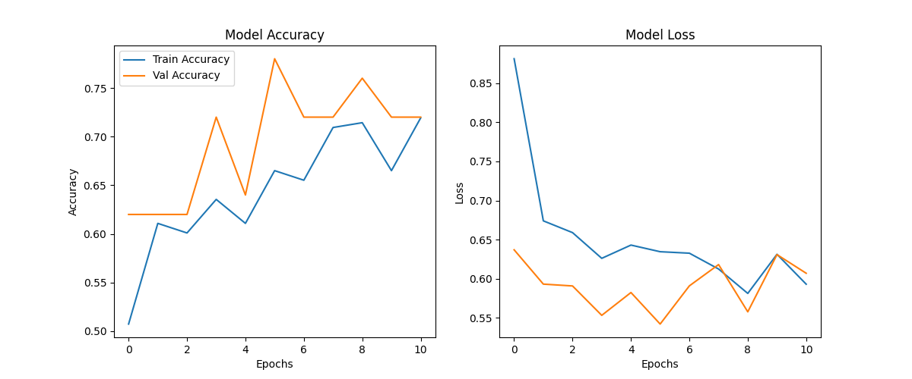
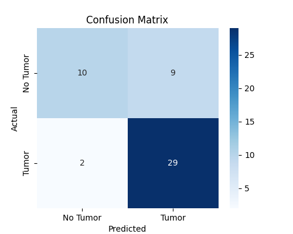

# 🧠 Brain Tumor Classification using CNN & EfficientNet

## 📌 Project Overview
This project builds a **Deep Learning model** to classify **MRI brain scans** into two categories:
- ✅ Tumor Present (**Yes**)  
- ❌ No Tumor (**No**)  

We use **EfficientNetB0 (Transfer Learning)** to achieve **high accuracy** while keeping the model lightweight.  

---

## 📂 Dataset
The dataset is structured as follows:

```
dataset/
│── yes/       # MRI images with tumor
│── no/        # MRI images without tumor
```

- All images are resized to **224x224**.  
- Grayscale images are automatically converted to **RGB (3 channels)** for EfficientNet.  

---

## 🚀 How to Run
1. Clone this repository or download the `.ipynb` notebook.  
2. Install dependencies:
   ```bash
   pip install tensorflow keras matplotlib seaborn scikit-learn
   ```
3. Place your dataset in a `dataset/` folder with `yes` and `no` subfolders.  
4. Open the notebook and run all cells:
   ```bash
   jupyter notebook Brain_Tumor_CNN.ipynb
   ```

---

## 📊 Training & Evaluation
The training process produces visualization plots for **Accuracy** and **Loss**:  

### 📈 Accuracy Curve


### 📉 Loss Curve


### 🔢 Confusion Matrix


👉 These images are generated during training and saved in the `images/` folder.  

---

## 🏆 Results
- Model trained using **EfficientNetB0 + Fine-Tuning**.  
- Achieved **high validation accuracy** on MRI dataset.  
- Robust performance in detecting tumor vs non-tumor cases.  

---

## 🔮 Future Improvements
- Experiment with **EfficientNetV2 / Vision Transformers (ViT)**.  
- Apply **data augmentation** for improved generalization.  
- Deploy as a **web app** using Streamlit or Flask.  
    